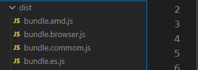

# rollup

可以参考的文章：

- [最详细的Rollup打包项目教程](https://juejin.cn/post/7145090564801691684)


## rollup 的定义

Rollup 是一个 JavaScript 的模块化打包工具，可以帮助我们编译小的代码到一个大的、复杂的代码中，比如一个库或者一个应用程序


## rollup 与 webpack

总的来说，rollup 的定位与 webpack 很相似：

- Rollup 也是一个模块化的打包工具，默认是针对 ES Module 进行打包的，也就是在不使用插件的情况下，Rollup 不能打包 commonjs
- webpack 通常可以通过各种 loader 处理各种各样的文件，以及处理它们的依赖关系；rollup 更多时候是专注于处理 JavaScript 代码（当然也可以处理css、font、vue等文件）
- rollup 的配置和理念相对于 webpack 来说，更加的简洁和容易理解
- 在早期 webpack 不支持 tree shaking 时，rollup 具备更强的优势
- rollup 打包出来的文件体积会比 webpack 小一些

所以，总的来说，rollup 更加适合**纯js库文件的打包**（例如 vue、react 源码）；而 webpack 更加适合项目、组件库打包（例如基于 vue 或者 react 开发的项目）


## 基本使用


### 配置文件

跟 webpack 类似，rollup 也是通过配置文件，传入需要使用的打包配置

在项目根目录下创建 rollup.config.js 文件

```
rollup-test
├── node_modules
├── src
├── └── index.js
└── rollup.config.js
```

然后 rollup.config.js 中：

```js
export default {
  
}
```

这里导出也可以使用 `module.exports = {}`，但 rollup 更多的是打包 esmodule 的，所以一般习惯使用 es 的模块化导出


配置 package.json

```js
{
    "scripts": {
        "build": "rollup -c"
     }
}
```

- -c 后面可以指定配置文件，如果使用默认 rollup.config.js 则不需要写
- -w 代表开启文件监听，当文件发生变化，重新编译


### 出入口

#### 入口

```js
export default {
  input: './src/index.js'
}
```

跟 webpack 类似，只是名字从 webpack 的 entry 改为 input


#### 出口

看看出口的几个属性

- format：打包的模式

  - iife：打包浏览器的库，iife 其实就是自执行函数

    打包后的代码：

    ```js
    // 就是定义了一个自执行函数，在浏览器中执行
    (function (exports) {
      'use strict';
    
      const sum = (num1, num2) => {
        return num1 + num2
      };
    
      console.log(sum(1, 2));
    
      exports.sum = sum;
    
      Object.defineProperty(exports, '__esModule', { value: true });
    
      return exports;
    
    }({}));
    ```

  - es：打包使用 es 导出的库

    打包后的代码：

    ```js
    const sum = (num1, num2) => {
      return num1 + num2
    };
    
    console.log(sum(1, 2));
    
    export { sum };
    ```

  - amd：打包 amd 的库

    打包后的代码：

    ```js
    define(['exports'], function (exports) { 'use strict';
    
      const sum = (num1, num2) => {
        return num1 + num2
      };
    
      console.log(sum(1, 2));
    
      exports.sum = sum;
    
      Object.defineProperty(exports, '__esModule', { value: true });
    
    });
    ```

  - cjs：打包 CommomJS 的库

    打包后的代码：

    ```js
    'use strict';
    
    Object.defineProperty(exports, '__esModule', { value: true });
    
    const sum = (num1, num2) => {
      return num1 + num2
    };
    
    console.log(sum(1, 2));
    
    exports.sum = sum;
    ```

  - umd：打包通用库（就是上面三种都支持），需要注意的是，使用 umd 必须在出口中设置 name 属性

    打包后的代码：

    ```js
    (function (global, factory) {
      // 判断是使用哪种环境，CommonJS 还是 amd 还是 浏览器
      typeof exports === 'object' && typeof module !== 'undefined' ? factory(exports) :
      typeof define === 'function' && define.amd ? define(['exports'], factory) :
      (global = typeof globalThis !== 'undefined' ? globalThis : global || self, factory(global.gweidUtils = {}));
    }(this, (function (exports) { 'use strict';
    
      const sum = (num1, num2) => {
        return num1 + num2
      };
    
      console.log(sum(1, 2));
    
      exports.sum = sum;
    
      Object.defineProperty(exports, '__esModule', { value: true });
    
    })));
    ```

- name：指定的名字，到时候别的地方引用这个包可以通过这个名字（umd 格式必须要指定 name）

- file：打包后的文件名字（可以跟上路径，例如：dist/bundle.js）

rollup.config.js 配置：

```js
export default {
  input: './src/index.js',
  output: {
    format: 'umd',
    name: 'gweidUtils', // umd 必须要有 name
    file: 'dist/bundle.js'
  }
}
```

使用 umd 打包通用的库模式固然好，但是这样子就会有兼容代码在里面，造成库过大

解决方案：分别打包支持不同环境的库

```js
export default {
  input: './src/index.js',
  output: [
    {
      format: 'iife',
      name: 'gweidUtils',
      file: 'dist/bundle.browser.js'
    },
    {
      format: 'es',
      file: 'dist/bundle.es.js'
    },
    {
      format: 'amd',
      file: 'dist/bundle.amd.js'
    },
    {
      format: 'cjs',
      file: 'dist/bundle.commom.js'
    }
  ]
}
```

就可以分别生成支持不同环境的库文件

 


### 打包 CommonJS 代码

rollup 默认是针对 esmodule 打包的，也就是说，在代码中通过 commonjs 的方式写代码，虽然是不会打包失败，但是打包出来的代码浏览器并不能识别，所以会造成浏览器报错

例如：

> src/utils/common.js

```js
const msg = 'commonjs 模块化'

module.exports = {
  msg
}
```

> src/index.js

```js
const { msg } = require('./utils/common')

console.log(msg)
```

打包后的结果：

```js
(function (factory) {
	typeof define === 'function' && define.amd ? define(factory) :
	factory();
}((function () { 'use strict';

	const { msg } = require('./utils/common');

	console.log(msg);
})));
```

可以看到，打包后依然是通过 require 引入代码，直接在浏览器中是不能识别的，所以会报错

此时，就需要用到插件去处理，rollup 官方插件库：

```
https://github.com/rollup/plugins
```

使用 `@rollup/plugin-commonjs` 处理：

安装：

```js
npm install @rollup/plugin-commonjs -D
```

使用：

```js
import commonjs from '@rollup/plugin-commonjs'

export default {
  input: './src/index.js',
  output: {
    format: 'umd',
    name: 'gweidUtils',
    file: 'dist/bundle.common.js'
  },
  plugins: [
    commonjs()
  ]
}
```

但是同时注意，在导入的时候改为：esmodule 方式

> src/index.js

```js
import { msg } from './utils/common'

console.log(msg)
```

如果不安装 commonjs 的时候，使用 CommonJS 导出，esModule 导入打包会报错

**基于以上问题，还是不建议在 rollup 中写 CommonJS 的代码，直接写 esModule 代码**

思考：为什么 rollup 要这样子做呢？支持  CommonJS 导出，但是必须要 esModule 导入，并且就算是 CommonJS 导出的也必须使用 esModule 导入，通过 `@rollup/plugin-commonjs` 解决

> 因为，当在 rollup 中使用到一些第三方库的时候，可能第三方库就只有 CommonJS 导出的，那么就需要支持 CommonJS 导出


### 使用第三方库

比如，需要使用 lodash：

> src/index.js

```js
import _ from 'lodash'

console.log(_.merge({name: 'hahaha'}, {age: 18}))
```

如果直接打包，会发现打包后的结果根本就没有 lodash 代码：

```js
(function (global, factory) {
	typeof exports === 'object' && typeof module !== 'undefined' ? factory(require('lodash')) :
	typeof define === 'function' && define.amd ? define(['lodash'], factory) :
	(global = typeof globalThis !== 'undefined' ? globalThis : global || self, factory(global._));
}(this, (function (_) { 'use strict';

	function _interopDefaultLegacy (e) { return e && typeof e === 'object' && 'default' in e ? e : { 'default': e }; }

	var ___default = /*#__PURE__*/_interopDefaultLegacy(_);

	console.log(___default['default'].merge({name: 'hahaha'}, {age: 18}));

})));
```

这是因为，rollup 中规定使用第三方包，也就是安装在 node_modules 下面的包，需要使用插件 `@rollup/plugin-node-resolve` 处理

安装：

```js
npm install @rollup/plugin-node-resolve -D
```

使用：lodash 也是 common 导出的，所以也需要使用插件 `@rollup/plugin-commonjs`

```js
import commonjs from '@rollup/plugin-commonjs'
import nodeResolve from '@rollup/plugin-node-resolve' // 引用第三方包

export default {
  input: './src/index.js',
  output: {
    format: 'umd',
    name: 'gweidUtils',
    file: 'dist/bundle.common.js'
  },
  plugins: [
    commonjs(),
    nodeResolve()
  ]
}
```


如果不想将 lodash 打包进 bundle 里面，也可以使用外链的形式，使用 external 属性排除需要打包的三方包，配置 output 的 globals

```js
import commonjs from '@rollup/plugin-commonjs'
import nodeResolve from '@rollup/plugin-node-resolve' // 引用第三方包

export default {
  input: './src/index.js',
  output: {
    format: 'umd',
    name: 'gweidUtils',
    file: 'dist/bundle.common.js',
    globals: {
      lodash: "_"
    }
  },
  external: ['lodash'],
  plugins: [
    commonjs(),
    nodeResolve()
  ]
}
```

这样子，就不会将 lodash 打包进去了，但是需要使用者手动引入 

```js
<!DOCTYPE html>
<html lang="en">
<head>
    <meta charset="UTF-8">
    <meta http-equiv="X-UA-Compatible" content="IE=edge">
    <meta name="viewport" content="width=device-width, initial-scale=1.0">
    <title>Document</title>
</head>
<body>
    // 手动引入 lodash
    <script src="https://cdn.jsdelivr.net/npm/lodash@4.17.21/lodash.min.js"></script>
    <script src="./dist/bundle.common.js"></script>
</body>
</html>
```


每个类库都要手动添加至 externals 未免太麻烦，这时候可以用 `rollup-plugin-node-externals` 插件，自动将外部类库声明为 externals。

安装：

```shell
npm install rollup-plugin-node-externals -D
```

使用：

```js
import externals from "rollup-plugin-node-externals";

export default [
  {
    plugins: [
      externals({
        devDeps: false, // devDependencies 类型的依赖就不用加到 externals 了。
      }),
    ],
  },
];
```


### 使用 babel 转换代码

在 rollup 中使用 babel 跟 webpack 很相似，首先，安装：

```js
npm i @babel/core @rollup/plugin-babel @babel/preset-env -D
```

使用：

rollup.config.js:

```js
import babel from '@rollup/plugin-babel'

export default {
  input: './src/index.js',
  output: {
    format: 'umd',
    name: 'gweidUtils',
    file: 'dist/bundle.js'
  },
  plugins: [
    babel({
      babelHelpers: 'bundled', // 代表后面很多东西使用同一个类，只创建一个类
      exclude: 'node_modules/**' // 忽略 node_modules
    })
  ]
}
```

根目录建 babel.config.js

```js
module.exports = {
  presets: [
    '@babel/preset-env'
  ]
}
```


### 使用 terser 压缩 js

rollup 官方并没有提供 terser，但是可以去社区找找，比如直接在 github 中搜索：rollup-plugin-terser，一般在 github 中找 rollup 插件，都快同意使用 rollup-plugin-xxx 的形式

安装：

```js
npm i rollup-plugin-terser -D
```

使用：

```js
import { terser } from 'rollup-plugin-terser'

export default {
  input: './src/index.js',
  output: {
    format: 'umd',
    name: 'gweidUtils',
    file: 'dist/bundle.js'
  },
  plugins: [
    terser()
  ]
}
```


### 使用 postcss 处理 css、sass、less

postcss 处理 css，给 css 添加前缀（rollup-plugin-postcss 默认集成了对css、 scss、less、stylus 的支持）

安装：

```js
npm i postcss rollup-plugin-postcss postcss-preset-env -D
```

使用：

```js
import postcss from 'rollup-plugin-postcss'
import postcssPresetEnv from 'postcss-preset-env'

export default {
  input: './src/index.js',
  output: {
    format: 'umd',
    name: 'gweidUtils',
    file: 'dist/bundle.js'
  },
  plugins: [
    postcss({
      plugins: [
        postcssPresetEnv({ browsers: ['last 2 version'] })
      ] 
    })
  ]
}
```


可以使用 cssnano 对 css 进行压缩处理

安装：

```shell
npm install cssnano -D
```

使用：

```js
import cssnano from "cssnano";
import postcss from "rollup-plugin-postcss";

export default {
  input: "src/main.js",
  output: {
    file: "bundle.js",
    format: "umd",
    name: "test",
  },
  plugins: [
    postcss({
      plugins: [cssnano()],
    }),
  ]
};
```


抽离单独的 css 文件

```js
import cssnano from "cssnano";
import postcss from "rollup-plugin-postcss";

export default [
  {
    plugins: [
      postcss({
        plugins: [cssnano()],
        extract: "css/index.css",
      }),
    ],
  },
];
```


#### 处理 Typescript

可以使用 ` 插件对 typescript` 插件对 typescript 进行处理

安装：

```shell
npm install @rollup/plugin-typescript -D
```

使用：

```js
import typescript from "@rollup/plugin-typescript";
export default [
  {
    plugins: [typescript()];
  }
];
```


导出类型声明文件：

```js
import typescript from "@rollup/plugin-typescript";
export default [
  {
    plugins: [
        typescript({
            outDir: "dist",
            declaration: true,
            declarationDir: "dist",
        })
    ];
  }
];
```


或者使用 `rollup-plugin-typescript2` 插件对 typescript 进行处理


#### 打包产物清除调试代码

可以通过插件 `@rollup/plugin-strip` 删除代码中的 debugger 语句和函数。包括 assert.equal、console.log 等等

安装：

```shell
npm install @rollup/plugin-strip -D
```

使用：

```js
import strip from "@rollup/plugin-strip";

export default [
  {
    plugins: [
        strip()
    ];
  }
];
```


### 搭建本地服务

使用 `rollup-plugin-serve` 搭建本地服务

安装：

```js
npm i rollup-plugin-serve -D
```

使用：

```js
import devServer from 'rollup-plugin-serve'

export default {
  input: './src/index.js',
  output: {
    format: 'umd',
    name: 'gweidUtils',
    file: 'dist/bundle.js'
  },
  plugins: [
    devServer({
      open: true, // 自动打开浏览器
      port: 9000,
      contentBase: '.' // 服务于哪个文件夹，一般跟 index.html 保持一致
    })
  ]
}
```


使用  `rollup -c -w` 实现：当文件发生变化，重新编译

使用 `rollup-plugin-livereload` 实现：自动刷新浏览器

配置 package.json

```js
{
    "scripts": {
        "dev": "rollup -c -w",
     }
}
```

安装 ：

```js
npm i rollup-plugin-livereload-D
```

使用：

```js
import devServer from 'rollup-plugin-serve'
import livereload from 'rollup-plugin-livereload'

export default {
  input: './src/index.js',
  output: {
    format: 'umd',
    name: 'gweidUtils',
    file: 'dist/bundle.js'
  },
  plugins: [
    // 开启本地服务器
    devServer({
      open: true, // 自动打开浏览器
      port: 9000,
      contentBase: '.' // 服务于哪个文件夹，一般跟 index.html 保持一致
    }),
    // 自动刷新浏览器
    livereload()
  ]
}

```


### 开发生产环境区分

在 package.json 中配置：

```js
{
    "scripts": {
      "dev": "rollup -c --environment NODE_ENV:development -w",
      "build": "rollup -c --environment NODE_ENV:production"
    }
}
```

然后在 rollup.config.js 中可以通过 `process.env.NODE_ENV` 获取到

最后完整实例：

```js
import commonjs from '@rollup/plugin-commonjs'
import nodeResolve from '@rollup/plugin-node-resolve' // 引用第三方包

import babel from '@rollup/plugin-babel'
import { terser } from 'rollup-plugin-terser'
import postcss from 'rollup-plugin-postcss'
import postcssPresetEnv from 'postcss-preset-env'

import devServer from 'rollup-plugin-serve'
import livereload from 'rollup-plugin-livereload'

const isProd = process.env.NODE_ENV === 'production'

const plugins = [
  commonjs(),
  nodeResolve(),
  babel({
    babelHelpers: 'bundled', // 代表后面很多东西使用同一个类，只创建一个类
    exclude: 'node_modules/**' // 忽略 node_modules
  }),
  postcss({
    plugins: [
      postcssPresetEnv({ browsers: ['last 2 version'] })
    ]
  })
]

if (isProd) {
  plugins.push(terser())
} else {
  plugins.push(...[
    // 开启本地服务器
    devServer({
      open: true, // 自动打开浏览器
      port: 9000,
      contentBase: '.' // 服务于哪个文件夹，一般跟 index.html 保持一致
    }),
    // 自动刷新浏览器
    livereload()
  ])
}

export default {
  input: './src/index.js',
  output: {
    format: 'umd',
    name: 'gweidUtils',
    file: 'dist/bundle.js',
    globals: {
      lodash: "_"
    }
  },
  external: ['lodash'],
  plugins: plugins
}
```


## 总结

rollup 的能力大部分都是通过插件赋予的


